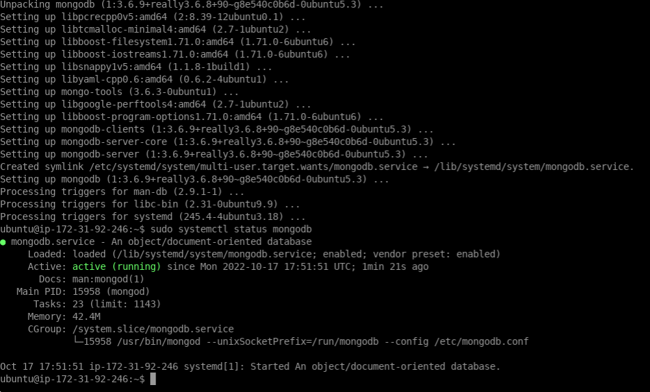
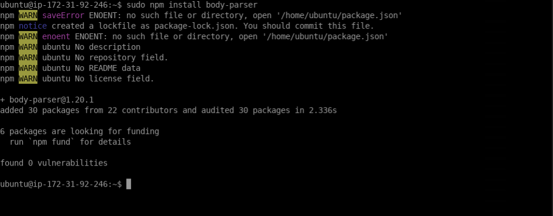
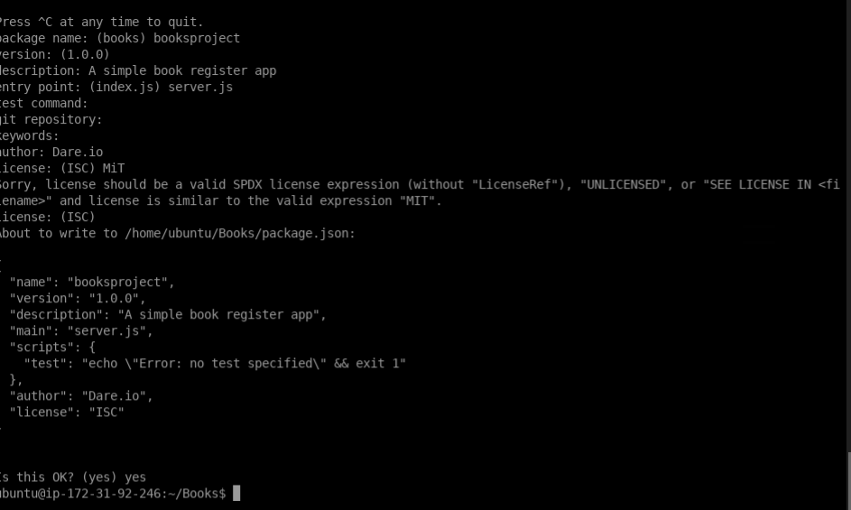
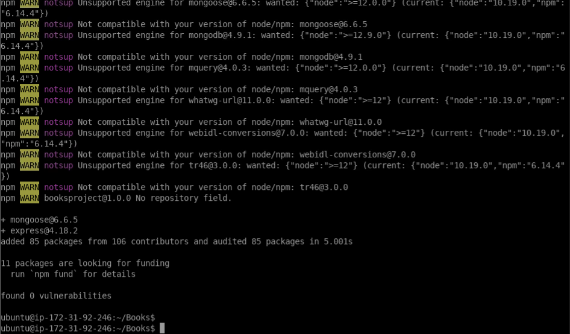
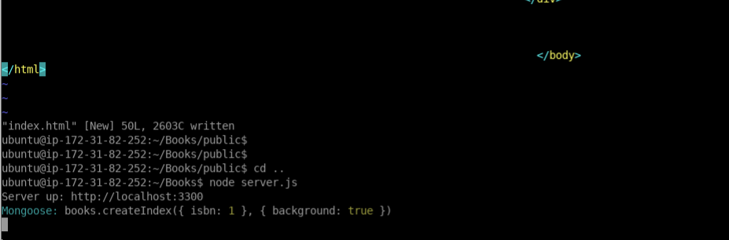
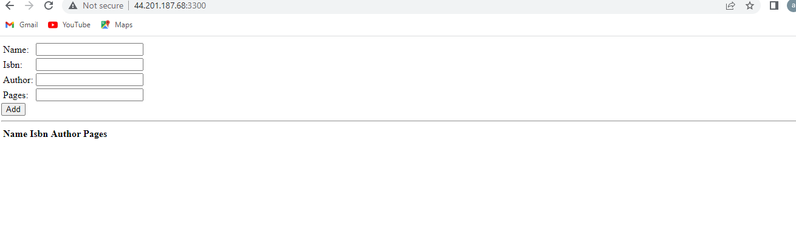

**MEAN STACK DEPLOYMENT TO UBUNTU IN AWS**

**Install MongoDB**

**Verify that the service is up and running**

**With the command sudo systemctl status mongodb**

****

**Install body-parser package**

**Install body-parser package**

****

**Create a folder named ‘Books’**

**mkdir Books && cd Books**

**npm init**

****

**INSTALL EXPRESS AND SET UP ROUTES TO THE SERVER**

**sudo npm install express mongoose**

****

**node server.js**

****

**Web Book Register Application**

****

